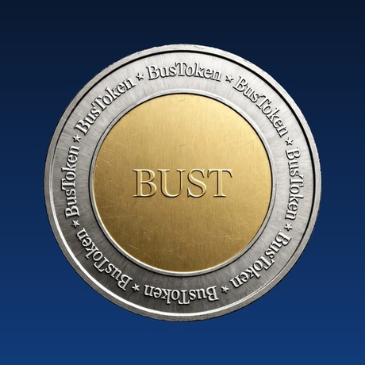

<p align="center">
  
</p>

<h1 align="center">BUSToken ($BUST)</h1>
<p align="center"><strong>The Community Meme Token on Base Chain</strong></p>

<p align="center">
  <a href="https://bustoken.space">Website</a> •
  <a href="https://basescan.org">BaseScan</a> •
  <a href="https://x.com/">Twitter</a> •
  <a href="https://t.me/">Telegram</a>
</p>

---

### 🚀 What is BUSToken?

**BUSToken ($BUST)** is a community-driven meme token built on **Base Chain**. 
80% Dev - 20% Meme. Serious tech, fun culture.

- **Chain:** Base (Coinbase L2)
- **Symbol:** $BUST
- **Supply:** 1,000,000,000 BUST
- **Official Org:** [bustoken-space](https://github.com/bustoken-space)

### 🛡️ Official & Protected

This is the **ONLY official repository** for BUSToken.

- **Official Website:** https://bustoken.space
- **Official GitHub:** https://github.com/bustoken-space
- **Copyright:** © 2026 Boubacar Sow

Any other token, repository or website using the name BUSToken or the logo is **NOT official** and is considered a scam/clone. Report clones via GitHub DMCA.

### 📦 Repository Structure

```
/logo.png - Official Logo (Silver/Gold BUST coin on Blue)
/LICENSE - MIT License © Boubacar Sow
/README.md - This file
```

### 📜 License

MIT License - See [LICENSE](./LICENSE) file.
You can fork and use the code, but you must keep the original copyright notice. The brand name "BUSToken" and the logo are trademark of the project.

### ⚠️ Disclaimer

$BUST is a meme token with no intrinsic value or expectation of financial return. This repository is for educational and community purposes.

---

<p align="center">Built with 💙 on Base by the BUST community</p>
